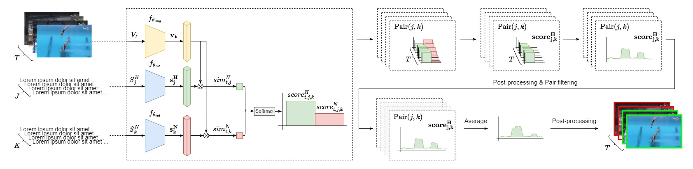

# Text-Guided Sports Video Summarizer <br>*(SportCLIP — official code release)*

This repository contains the code, example data and reproducibility scripts for the paper  
**“Text-Guided Sports Highlights: A CLIP-Based Framework for Automatic Video Summarization”**.

[[`Webpage`]](http://gti.ssr.upm.es/data/sportclip) | [[`Paper`]](#citation)



`# TODO: Rename python modules so that they make more sense (i.e., summarize.py -> summarize.py)`<br>
`# TODO: Rename GitHub repo to just SportCLIP (and rename the one I use for the private repository to something else)`<br>

Our framework turns **any** sports video into a concise highlight reel by leveraging [OpenAI CLIP](https://github.com/openai/CLIP) image–text embeddings. The workflow is broken into three clear stages:

1. **Frame & embedding extraction** (`extractor.py`)
2. **Prompt engineering** (`multi_sentences.py`)
3. **Highlight extraction & evaluation** (`summarize.py`)

---

## Table of Contents

* [Installation](#installation)
* [Quick-start](#quick-start)
* [Directory Structure](#directory-structure)
* [Configuration](#configuration)
* [Outputs & Results](#outputs--results)
* [Citation](#citation)

---

## Installation

> Tested with **Python ≥ 3.10** on Linux/macOS and with an NVIDIA GPU + CUDA (CPU also works, but slower).

```bash
# 1. Clone the repository
$ git clone https://github.com/MarcosRodrigoT/SportCLIP.git
$ cd SportCLIP

# 2. Create an isolated environment (recommended)
$ python3 -m venv venv
$ source venv/bin/activate  # Windows: venv\Scripts\activate

# 3. Install Python dependencies
$ pip install --upgrade pip
$ pip install -r requirements.txt

# 4. Install and test FFmpeg / FFprobe (needed by extractor.py)
$ sudo apt install -y ffmpeg
$ ffmpeg -version && ffprobe -version  # should print version info
```

---

## Quick-start

Assuming you have a video (e.g., **`data/long_jump.mp4`**) and its frame-level annotation file (e.g., **`data/long_jump.csv`**):

```bash
# 1. Extract frames & CLIP embeddings
$ python extractor.py \
        --video data/long_jump.mp4 \
        --annotations data/long_jump.csv \
        --frames-per-second 29.97

# 2. Run multiple sentence prompts to discover the best highlight / non-highlight pairs
$ python multi_sentences.py
# ▸ results are written to results/<video_name>/

# 3. Generate final video summary (highlight reel), plots & evaluation metrics
$ python summarize.py
# ▸ results are written to results/<video_name>/
```

All default hyper-parameters are hard-coded in the corresponding scripts and can be overridden via command-line flags or by editing the classes at the top of each file.

---

## Directory Structure

```text
.
├── extractor.py
├── multi_sentences.py
├── summarize.py
├── utils.py
├── requirements.txt
├── data/                 # ─► videos & ground-truth annotations
├── imgs/                 # ─► one sub-folder per video with extracted frames     (generated)
├── img_embeddings/       # ─► one sub-folder per video with CLIP embeddings      (generated)
└── results/              # ─► per-video plots, logs & metrics                    (generated)
```

---

## Configuration

### Dataset layout

Place all **videos** and their **ground-truth annotation files** in the `data/` folder:

* Videos: `*.mp4`, `*.mpeg`, `*.avi`, …
* CSV annotations: `*.csv` (must include the columns `Event type`, `First frame`, `Last frame`, `Num. frames`).

When trying out [MATDAT](http://gti.ssr.upm.es/data/matdat) and [SportCLIP](http://gti.ssr.upm.es/data/sportclip) datasets, extract all videos and ground-truth annotation files to this directory:

```text
data/
├── V1.mpeg
├── V1.csv
├── V2.mpeg
├── V2.csv
├── V3.mpeg
├── V3.csv
├── diving.mp4
├── diving.csv
├── long_jump.mp4
├── long_jump.csv
├── pole_vault.mp4
├── pole_vault.csv
├── tumbling.mp4
└── tumbling.csv
```

---

### Trying out new sentences or sports

Edit the **`Config`** class in **`multi_sentences.py`** to point to a different video or to craft sport-specific prompts. Use the template below as a guide and adapt the lists of `highlight_sentences` and `not_highlight_sentences` to your domain:

```python
class Config:
    # Main parameters
    root_dir = "data"
    video_name = "long_jump"
    results_folder = f"results/{video_name}"
    os.makedirs(results_folder, exist_ok=True)

    context_window = 600
    instant_window = int(context_window / 10)
    closing_kernel = int(context_window / 10 + 1)
    min_duration = 15
    min_area = 15

    # Highlight and non-highlight sentences
    highlight_sentences = [
        "An athlete sprinting down the runway before launching into the air, reaching for maximum distance",
        "A long jumper executing a well-timed takeoff, soaring through the air before landing in the sand pit",
        "A person accelerating down the track, generating momentum for an explosive jump",
        "An athlete gliding through the air with extended arms and legs, preparing for a controlled landing",
        "A competitor demonstrating strength and precision in a long jump attempt",
        "A long jumper executing a perfect flight phase, reaching their peak height before descent",
        "An athlete pushing off the ground with powerful force, achieving an impressive airborne moment",
        "Athlete running, jumping into the air and landing in the sand pit",
    ]
    not_highlight_sentences = [
        "A long jumper adjusting their starting position on the runway",
        "A person discussing jump techniques with a coach",
        "An athlete waiting for their turn while observing competitors",
        "A group of athletes standing near the sand pit, preparing for their jumps",
        "A long jumper walking back after a completed attempt",
        "A judge measuring the distance of a jump while athletes watch",
        "A competitor stretching and warming up before their jump",
        "Athlete relaxed, greeting judges, celebrating",
    ]

    sentences = highlight_sentences + not_highlight_sentences

    # Plotting parameters
    hist_sharey = True            # Share y axis across individual histograms
    hist_scale_y = True           # Dynamic y-axis scaling
    draw_individual_plots = True
    frames_to_plot = [0, 7500]
```

---

### Generating the final highlight reel

Before executing **`summarize.py`**, adjust the top-level constants so they match your dataset and desired hyper-parameters:

```python
if __name__ == "__main__":
    # Videos
    DATASET_DIR = "data"
    VIDEO = "long_jump"
    GROUND_TRUTH = f"{DATASET_DIR}/{VIDEO}.csv"

    # Constants
    CONTEXT_WINDOW = 600
    INSTANT_WINDOW = int(CONTEXT_WINDOW / 10)
    CLOSING_KERNEL = int(CONTEXT_WINDOW / 10 + 1)
    MIN_DURATION = 15
    MIN_AREA = "dynamic"  # "dynamic" or numeric (e.g., 15)

    # Filters
    FILTER_SEPARATION = 0.1
    FILTER_RANGE = 0.4
    FILTER_AUC = 0.4
    HIST_DIV = 2

    # Ablation
    NUM_STEPS = 10
```

With these two edits you can quickly switch to new sports, experiment with prompt phrasing, or retune post-processing thresholds.

---

## Outputs & Results

After running the full pipeline you will find:

| Path                               | Description                                       |
| ---------------------------------- | ------------------------------------------------- |
| `results/<video>/Final result.png` | Summary plot of ground truth vs predictions       |
| `results/<video>/Pairs used.txt`   | List of prompt pairs kept after filtering         |
| `results/<video>/*.pkl`            | Pickled KDE curves, scores & auxiliary stats      |
| `results/<video>/*.png`            | Histograms and stitched diagnostic images         |
| `results/<video>/highlight.mp4`    | Final highlight reel                              |

---

## Citation

If you find our work useful in your research, please cite:

```bibtex
@article{rodrigo2025sportclip,
  title   = {Text-Guided Sports Highlights: A CLIP-Based Framework for Automatic Video Summarization},
  author  = {Marcos Rodrigo, Carlos Cuevas, and Narciso García},
  journal = {IEEE Transactions on Consumer Electronics},
  year    = {2025}
}
```

Happy summarizing! 🎬🏅